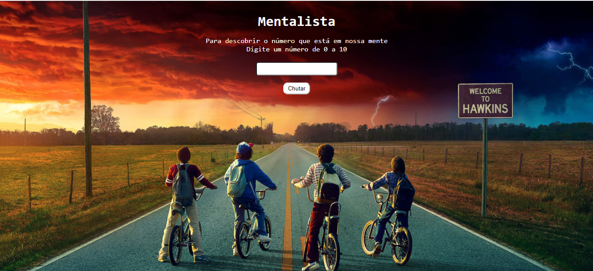

<h1  align=center> Mentalista </h1>

Descrição: página criada para treinar a lógica de programação com os conhecimentos básicos de Javascript. Dessa forma, o objetivo será acertar o valor gerado aleatoriamente pelo sistema, caso acerte será apresentado em tela uma mensagem de acerto com o número secreto. Caso erre, a tela apresentará uma mensagem orientando você no "chute" do número. 
